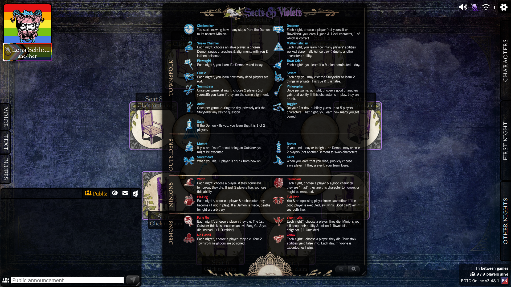
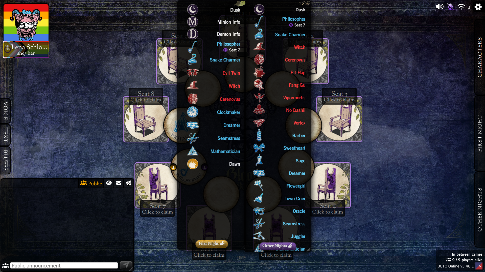
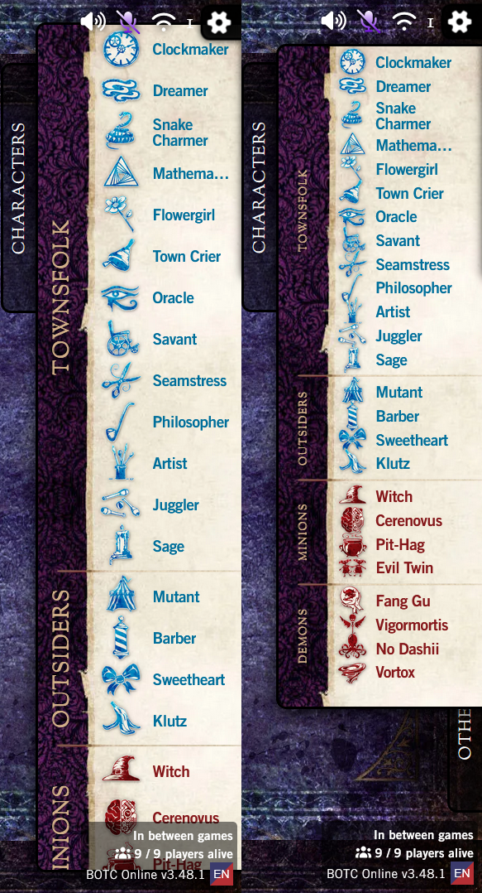
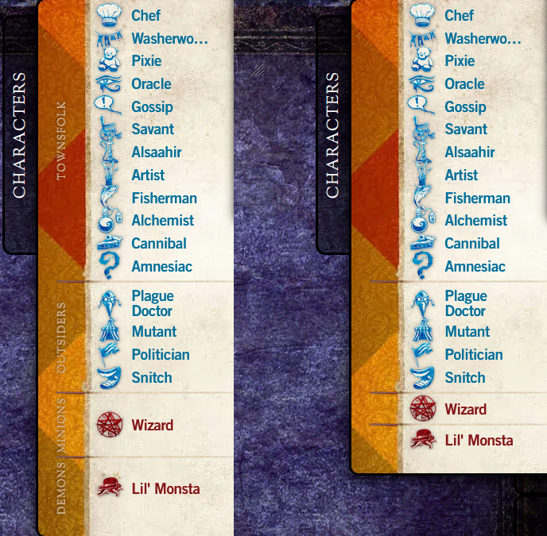
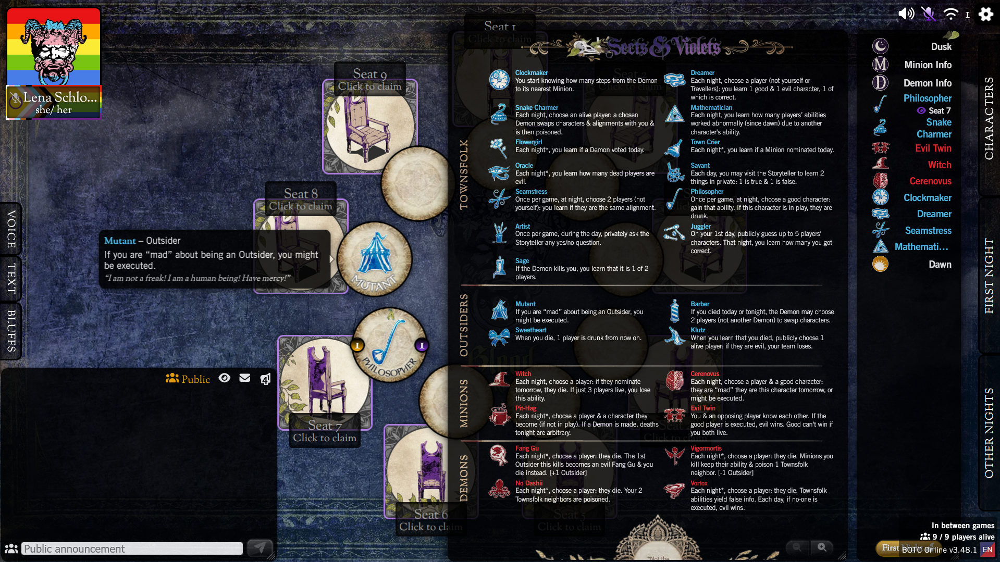
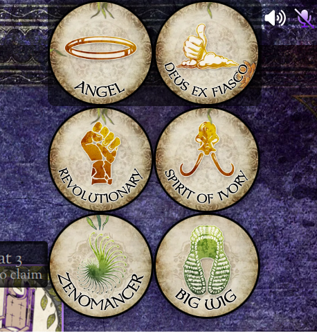

# BOTCAppCustomCSS
Some custom CSS I use to edit the look/ functionality of [botc.app](botc.app)

## Docked Tabs

Some of these only affect tabs when they're "undocked."  By default the tabs will be "docked," meaning the're attached the side of the screen.

To undock a tab, ensure you have "Allow Side Tabs Moving" setting enabled under the "General" tab at the bottom of the settings. (the checkbox looks like a yellow dragging cursor when enabled)

Click a tab once to half-open it, once again to expand it fully, then drag anywhere in the tab to undock it and place it anywhere.

To dock a tab afterwards, press the name of the tab on the side and it'll go back to it's place.

## How to use:
1. Open the Settings (press "Q" by default, or press the gear in the top right, at the bottom of the box pick the rightmost section which looks like 3 sliders, and choose "Settings")
2. Open the "Advanced" tab at the bottom right
3. Enable "Custom CSS Rules"
4. Click on the document button next to "Custom CSS Rules" and paste any code from here into the text box
5. Make sure to tick "I know what I'm doing, let me change the look of my app"
6. Hit confirm, and when the "Apply Custom CSS Rules?" popup appears press "yes"

## Bring Back Old Character Reference Sheet
Restyles the undocked Character Reference to resemble the old Character Reference Sheet. (Use your "Character Refence" shortcut from the shortcuts tab in the settings to toggle it on and off without needing to undock it again)

## Bring Back Old Night Order
Restyles the night order sheets to resemble the old night order popup, includes the "Toggle Both Night Sheet" style so they are both toggled on together.  This applies the dark mode to the sheets both when docked and undocked to prevent flashing when toggled.

## Compact Mode
This restores the old "Compact" setting that has since been removed, making the half-open character list show more roles at once.

## Compact Mode (Ultra)

This is the same as compact mode, but removes the "Townsfolk", "Outsider", "Minion" and "Demon" text from the side of the tab, which allows the tab to get much smaller.

## Dark Mode
Removes the papery backgrounds on night order sheets, character tab and hovered token ability text boxes and uses a style similar to that used elsewhere on the app (black background, white text). 

## Refitting NPC Tokens
Changes NPC token size + layout behaviour to be more predictable with any token count.  Using this layout, tokens will always be as tall as the size of the container (or as wide when container width < height), be top left rather than centre aligned, and wrap predictably.

The CSS has a section commented out, which lets the tokens outside the box be visible.  This is commented out because it **disables resizing** on the container.  I recommend placing and resizing the tokens with it commented out, then enabling it once you're happy with how they stack.

## Toggle Both Night Sheets
This makes it so when you use your "Night Order" shortcut, both the first and other nights order appear together when they're undocked, and are both interactible.

